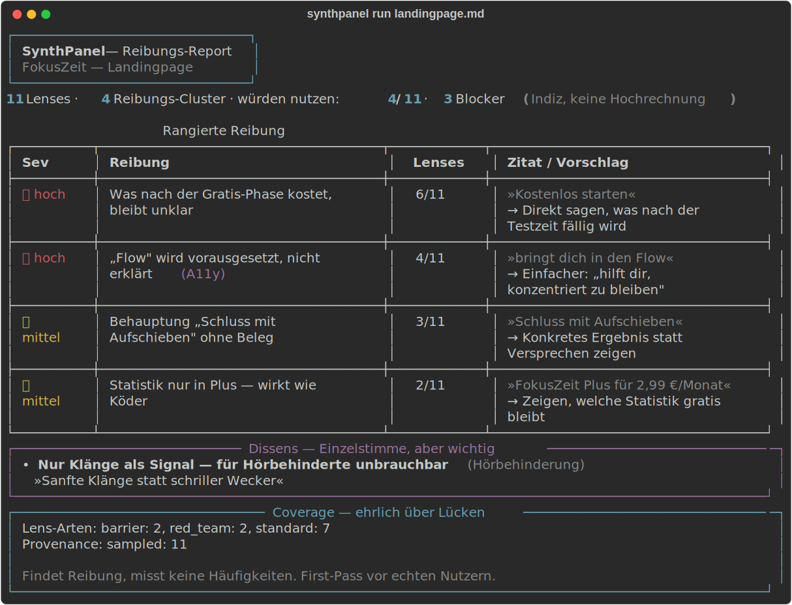

# SynthPanel

**Ein synthetisches Test-Panel auf der Kommandozeile.** Wirf ein Artefakt rein —
einen Pitch, ein App-Konzept, einen Store-Text — und ein Schwarm diverser Test-Personas
("Lenses") sagt dir, **woran echte Menschen stolpern würden**: jede Reibung mit Zitat
der auslösenden Stelle, sortiert nach Schwere.



> **Was es ist:** ein **Such-Werkzeug** — es findet blinde Flecken, die du selbst
> übersiehst.
> **Was es nicht ist:** ein Mess-Werkzeug. Es behauptet keine Prozente, keine
> Repräsentativität, keine „73 % mochten es". Ein LLM ist gut darin, *Reibung zu finden*,
> und wertlos darin, *Häufigkeiten zu schätzen* — SynthPanel baut nur auf die Stärke.
>
> Kein Ersatz für echte Nutzer. Der **kostenlose First-Pass davor** — am stärksten,
> wenn du noch keinen Prototyp hast, den echte Leute testen könnten.

---

## Schnellstart (0 €, lokal mit Ollama)

```bash
git clone https://github.com/spm231177-coder/synthpanel && cd synthpanel
pip install -e .              # installiert Abhängigkeiten + den Befehl `synthpanel`
ollama pull llama3.2:3b       # kleines Standard-Modell, läuft überall

synthpanel run examples/landingpage_demo.md \
    --audience "Menschen, die sich schwer konzentrieren können" \
    --kind "Landingpage"
```

(Ohne Installation geht auch `python -m synthpanel run …` direkt aus dem Repo.)

**Modellwahl = Analysetiefe.** Default ist `llama3.2:3b` — klein, schnell, läuft überall,
aber eher oberflächlich. Für gehaltvollere Reibung ein größeres lokales Modell
(`--model qwen2.5:7b`) oder die Cloud (`--backend anthropic`, Claude). Das genutzte
Modell steht im Report — keine Black Box.

### So sieht der Output aus

```
🔴 [HOCH] OBD-Anforderungen unklar — getroffen von 7/11 Lenses
   ├─ Zitat: »OBD-Funktionen brauchen einen ELM327-kompatiblen Adapter.«
   └─ Vorschlag: Welche Hardware nötig ist und was sie kostet, gehört nach oben.
```
Eine nach Schwere sortierte Liste im Terminal, plus Dissens-Block (wichtige
Einzelstimmen) und Coverage-Report (welche Blickwinkel abgedeckt wurden — und welche nicht).

Kein Ollama? Cloud-Pfad mit Anthropic (⚠ kostet Tokens, Warnung erscheint):

```bash
pip install anthropic
export ANTHROPIC_API_KEY=...
python -m synthpanel run examples/werhats.md --backend anthropic
```

Lenses ansehen:

```bash
python -m synthpanel lenses
```

---

## Wie es funktioniert

```
   Du ⇄ Artefakt + Zielgruppe
            │
            ▼
   Lens-Schwarm (parallel, gedrosselt) — jede Lens urteilt aus IHRER Lage
     · Framing-Balance: pro- UND contra-geframt → Mischwert (gegen Schleimen)
     · Evidence-Grounding: jede Reibung MUSS die auslösende Stelle zitieren
     · Modell-Router: Ollama (gratis) | Anthropic (Cloud)
            │
            ▼
   Synthese (deterministisch) → rangierte Reibungs-Liste + Dissens-Block + Coverage
```

### Die Lens Library
Eine kuratierte, **versionierte** Sammlung diverser Blickwinkel (`synthpanel/lenses/library.yaml`)
— Laien, Skeptiker, Preisbewusste, **Barriere-Lenses** (Screenreader, einfache Sprache)
und **Rote-Team-Lenses**, die das Produkt absichtlich zerlegen. Zweck ist **Coverage**
(decken wir die relevanten Lagen ab?), nicht Repräsentativität.

→ **PRs willkommen:** eigene Lenses, Barriere-Profile und lokale Sets ergänzen.

### Anti-Schleim
LLMs sind von Natur gefällig. Drei Gegenmittel sind eingebaut:
- **Framing-Balance** — Attraktivität wird pro- *und* contra-geframt abgefragt, der
  Mischwert neutralisiert die Zustimmungsverzerrung.
- **Rote-Team-Lenses** — immer ein Teil des Schwarms, strukturell skeptisch.
- **Dissens über Konsens** — der eine wichtige Einwand wird hervorgehoben, nie weggemittelt.

---

## Regressionstest — Fix anwenden, Wirkung sehen

Der eigentliche Wiederbenutzungs-Grund: einen Lauf als Snapshot festhalten, das
Artefakt verbessern, erneut laufen und **qualitativ** vergleichen.

```bash
# Runde 1 — Ausgangslage festhalten
python -m synthpanel run pitch.md --save-snapshot v1

# ... du verbesserst pitch.md anhand der Findings ...

# Runde 2 — vergleichen
python -m synthpanel run pitch.md --compare v1
```

Der Diff zeigt **✅ gelöst** (war da, jetzt weg), **🆕 neu** (Nebenwirkung des Fixes?)
und **➖ unverändert** (mit Lens-/Schwere-Änderung). Keine Prozente — qualitativ, ehrlich.

## Transparenz-Ansicht

```bash
python -m synthpanel run pitch.md --detailed        # jede Persona einzeln: Score, Blocker, Reibung, Begründung
python -m synthpanel run pitch.md --json report.json # kompletter strukturierter Export (teilbar)
```

`--detailed` macht nachvollziehbar, *warum* jede Persona so urteilt — kein Black-Box-Aggregat.

## Im CI — „ESLint für UX-Reibung"

Eine fertige GitHub-Action liegt unter [`.github/workflows/synthpanel.yml`](.github/workflows/synthpanel.yml):
Bei jedem Pull Request findet SynthPanel Reibungspunkte in deinem Text und **postet sie
als PR-Kommentar**. Einrichtung: Repo-Secret `ANTHROPIC_API_KEY` setzen (CI hat kein
lokales Ollama), optional `SYNTHPANEL_TARGET`/`SYNTHPANEL_AUDIENCE` als Repo-Variablen.

## Was noch kommt (Roadmap)
- **Adapter** für URLs (Playwright) und Bilder (Vision).
- **Eigene Persona-Sets** für Sprachen/Regionen (Community-PRs).

Vollständiger Plan: [`docs/synthpanel_masterplan.md`](../../docs/synthpanel_masterplan.md).

## Tests
```bash
python tests/test_synthesis.py
```

## Lizenz
MIT — siehe [LICENSE](LICENSE).
